# SALES TRANSACTION

### BACKGROUND
This dataset summarizes sales transactions in New York City throughout 2024, covering business activities across the boroughs of Queens, Brooklyn, and Manhattan. The data provides detailed sales breakdowns by product line and customer segmentation to support the analysis of consumer behavior across various urban areas.

### VARIABLE DESCRIPTION

- Date : Transaction date
- Branch : Store location
- Customer Type : Customer status
- Gender : Customer gender
- Rating : Customer satisfaction
- Product Line : Product Category
- Unit Price : Price per item
- Quantity : Number of items purchased
- Payment : Payment method

### KEY OBJECTIVE

Our objective is to analyze this data to generate a detailed performance report.:
1. The average revenue generated per transaction and total quantity of products sold.
2. Identification of the transaction with the highest purchase volume.
3. The distribution of the quantity, price, and total revenue variables.
4. The correlation between price and quantity.
5. The region with the highest number of transactions.
6. What are the most frequently purchased products?
7. Which region generates the highest and lowest total revenue?
8. What was the sales trend over the months?
9. Which products contribute the most to the total transaction earnings?
10. Based on your findings, what strategies would you recommend to the business to maximize profit?

***Load The Dataset***

| No | Date | Branch | Customer type | Gender | Product line | Unit price | Quantity | Payment | Rating |
|:---|:---|:---|:---|:---|:---|:---|:---|:---|:---|
| 0 | 1/1/2024 | Brooklyn | Member | Female | Food & Beverages | 84.63 | 10 | Credit card | 9.0 |
| 1 | 1/1/2024 | Queens | Normal | Female | Electronics | 63.22 | 2 | Cash | 8.5 |
| 2 | 1/1/2024 | Brooklyn | Normal | Female | Electronics | 74.71 | 6 | Cash | 6.7 |
| 3 | 1/1/2024 | Queens | Member | Female | Sports & Travel | 36.98 | 10 | Credit card | 7.0 |
| 4 | 1/1/2024 | Manhattan | Member | Female | Sports & Travel | 27.04 | 4 | Ewallet | 6.9 |

***Descriptive Statistics***

| Statistik | Unit price | Quantity | TotalMoney |
|:---|:---:|:---:|:---:|
| **count** | 5053.00 | 5053.00 | 5053.00 |
| **mean** | 39.69 | 4.59 | 186.53 |
| **std** | 29.56 | 2.79 | 200.20 |
| **min** | 2.01 | 1.00 | 2.18 |
| **25%** | 11.63 | 2.00 | 38.52 |
| **50%** | 33.90 | 4.00 | 109.60 |
| **75%** | 64.94 | 7.00 | 266.56 |
| **max** | 99.96 | 10.00 | 993.00 |

We can use descriptive statistics to see how diverse the data is for each numerical variable.

**1. The average revenue generated per transaction and total quantity of products sold**

- The average transaction in 2024 was ***$186.53***, with a maximum of ***$993*** and a minimum of ***$2.18***

- and the average quantity per transaction was 4 units, ranging from maximum of 10 and a minimum of 1

**2. Identification of the transaction with the highest purchase volume**

| | Date | Branch | Customer type | Gender | Product line | Unit price | Quantity | Payment | Rating | TotalMoney |
|---|---|---|---|---|---|---|---|---|---|---|
| 0 | 1/1/2024 | Brooklyn | Member | Female | Food & Beverages | 84.63 | 10 | Credit card | 9.0 | 846.30 |
| 1 | 1/1/2024 | Queens | Normal | Female | Electronics | 63.22 | 2 | Cash | 8.5 | 126.44 |
| 2 | 1/1/2024 | Brooklyn | Normal | Female | Electronics | 74.71 | 6 | Cash | 6.7 | 448.26 |
| 3 | 1/1/2024 | Queens | Member | Female | Sports & Travel | 36.98 | 10 | Credit card | 7.0 | 369.80 |
| 4 | 1/1/2024 | Manhattan | Member | Female | Sports & Travel | 27.04 | 4 | Ewallet | 6.9 | 108.16 |

- The product sold  in 2024 was have average $39.69, with a maximum of $99.96 and a minimum of $2.01

- There was 3 maximum price transactions, one was located in Queens, while the other two were in Brooklyn

**3. The distribution of the quantity, price, and total revenue variables**

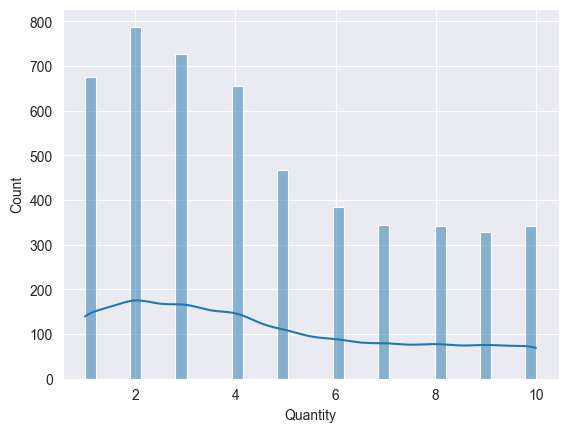

- The most purchases occurred in the amount of 2 units (close to 800 transactions), followed by 3 units and 1 unit.

- It seems that the trend is that the more items there are in a transaction, the lower the frequency.

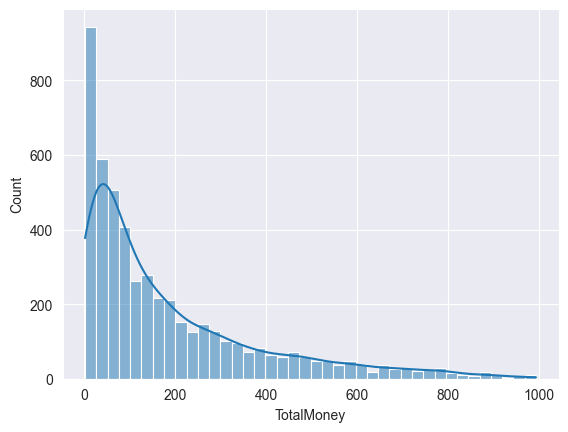

- The distribution of TotalMoney is heavily right-skewed, indicating that the vast majority of transactions are concentrated in the lower price range

**4. The correlation between price and quantity**

| | Unit price | Quantity |
|---|---|---|
| Unit price | 1.000000 | 0.050998 |
| Quantity | 0.050998 | 1.000000 |

- The correlation value shows a coefficient of 0.051 between Unit price and Quantity. This indicates a **weak correlation**, suggesting that the unit price has little to no linear impact on the quantity purchased per transaction.

- we can to visualize a histogram and scatterplot of more than 2 numeric variables in a dataframe to makes it easier to see the relationship between variables.

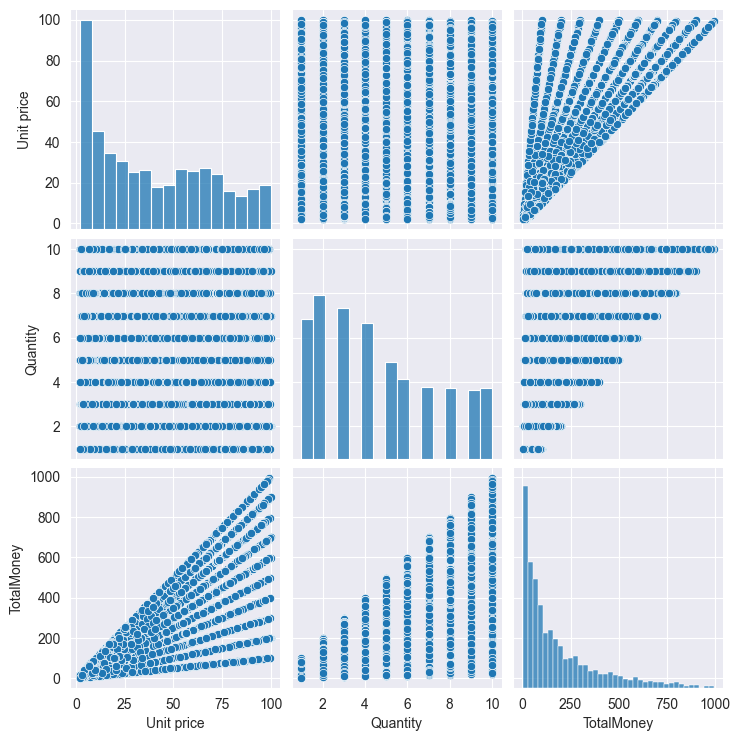

**5. The Region with the highest number of transactions**

| | Region | Percentage Transaction |
|---|---|---|
| 0 | Brooklyn | 35.483871 |
| 1 | Manhattan | 33.742331 |
| 2 | Queens | 30.773798 |

- Brooklyn stands as the leading contributor, accounting for 35.48% of the total transactions, closely followed by Manhattan at 33.74% and Queens at 30.77%. The relatively balanced distribution across these three cities indicates a stable and diversified market presence throughout the region.

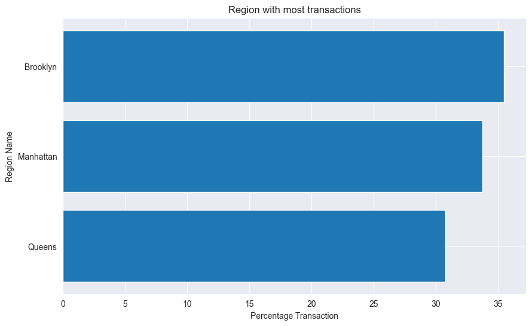

**6. the most frequently purchased products**

| | Product line | Percentage Transaction |
|---|---|---|
| 0 | Food & Beverages | 33.049673 |
| 1 | Health & Beauty | 18.959034 |
| 2 | Home & Lifestyle | 14.011478 |
| 3 | Fashion & Accs | 13.378191 |
| 4 | Sports & Travel | 11.399169 |
| 5 | Electronics | 9.202454 |

- Food & Beverages is the primary driver of transaction volume, accounting for 33.05% of all records. Health & Beauty follows as the second most active category at 18.96%. In contrast, Electronics records the lowest transaction frequency at 9.20%, which is typical for high-value, low-frequency purchase items

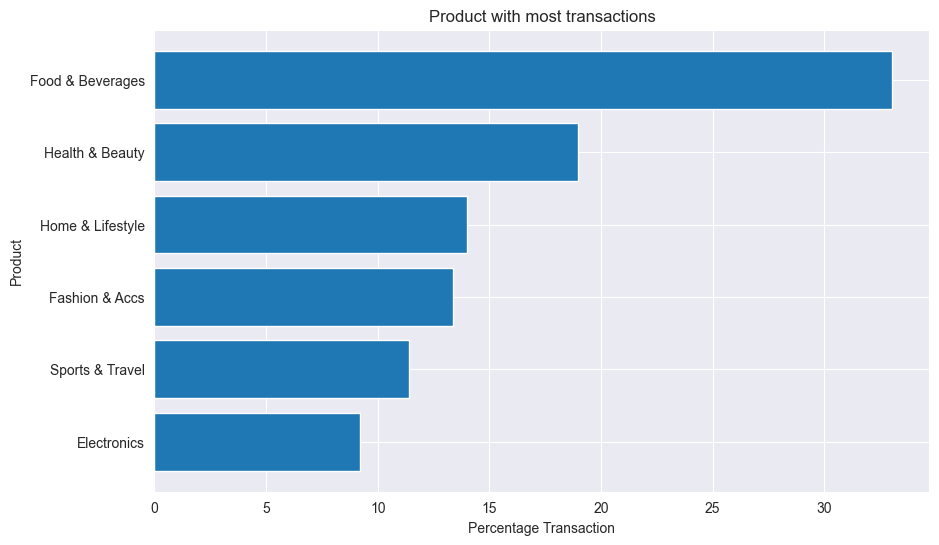

**7. Region generates the highest and lowest total revenue**

| | Region | TotalMoney |
|---|---|---|
| 0 | Brooklyn | 319705.48 |
| 1 | Queens | 312842.82 |
| 2 | Manhattan | 309996.55 |

- The total revenue across the three branches is remarkably balanced, with each city generating over $300,000. Brooklyn holds the top position with $319,705.48, followed closely by Queens and Manhattan. This minimal variance suggests consistent market demand and effective sales performance across all geographical locations.

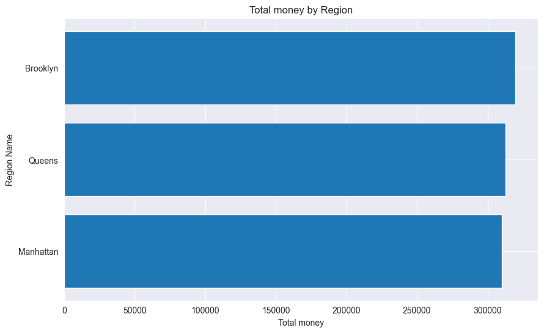

**8. The sales trend over the months**

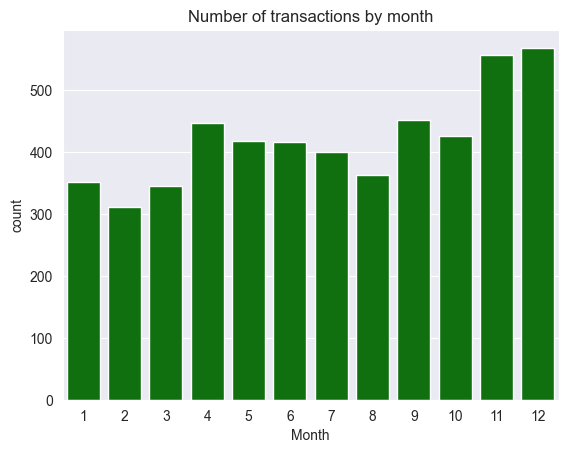

- The highest volume of transactions occurs at the end of the year, in December and November
-  The lowest transaction seen in February
- The chart shows a positive trend toward the end of the year. 

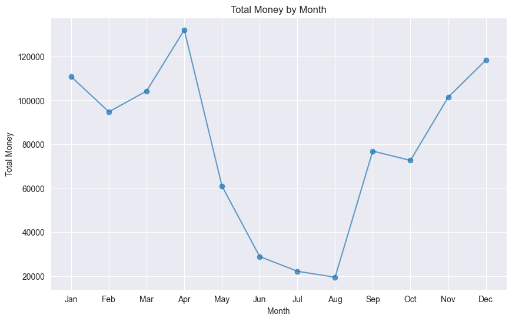 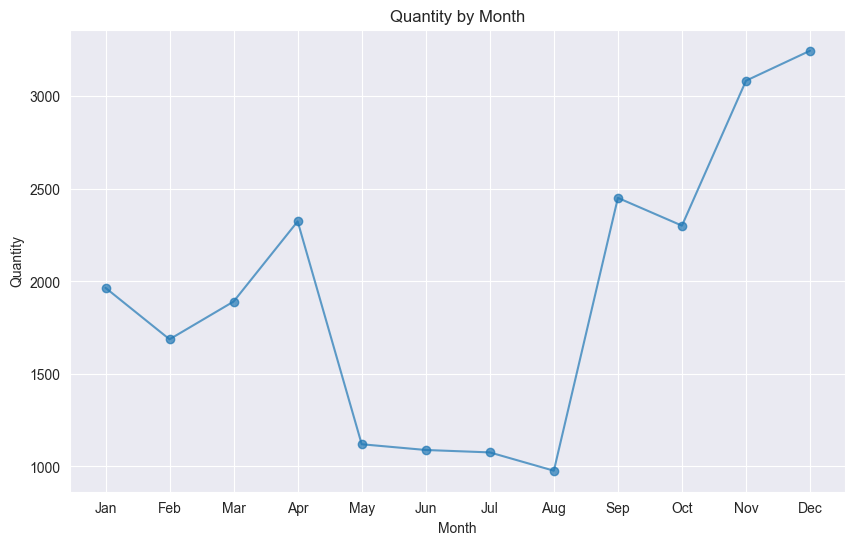

- In April, revenue was very high, even though the number of items sold was not as high as in December. This indicates that April likely sold more expensive products.
- In November and December, the number of items sold increased drastically, but the revenue did not increase as much as the increase in items.

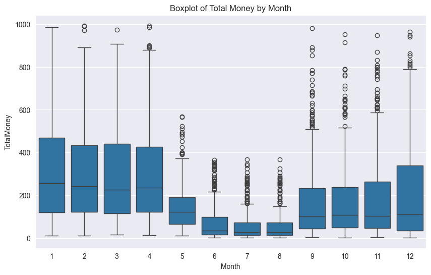

Based on a visual analysis of the three graphs, the transaction trend throughout the year can be categorized into three main phases. The period from January to April shows moderate transaction volume but a high average value per transaction. Conversely, the period from May to August is a period of stagnation with low activity and very little variation in transaction value. This trend then reverses drastically from September to December, where a surge in transaction volume is followed by the emergence of many extreme transaction values ​​(outliers), which are the main drivers of the increase in total revenue at the end of the year.

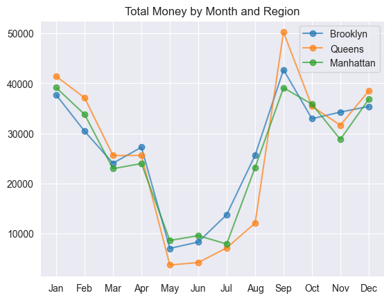

- While all regions follow a similar seasonal pattern, Queens shows the most fluktuativ, hitting the highest overall peak in September (over 50,000) despite having the lowest performance during the May–July period.
- Brooklyn demonstrated more resilience during the summer slump, maintaining higher revenue in July and August compared to the other two region.

**9. Top-Earning Products**

| | Product line | TotalMoney |
|---|---|---|
| 0 | Home & Lifestyle | 197260.56 |
| 1 | Health & Beauty | 168570.61 |
| 2 | Sports & Travel | 164252.94 |
| 3 | Electronics | 159259.10 |
| 4 | Food & Beverages | 151357.73 |
| 5 | Fashion & Accs | 101843.91 |

- Customers spend the most money on Home and lifestyle 
- Fashion may need a stronger promotional strategy or pricing evaluation.
- The Health & Beauty, Sports & Travel, Electronics, and Food & Beverages categories have figures that are not too far apart from each other.

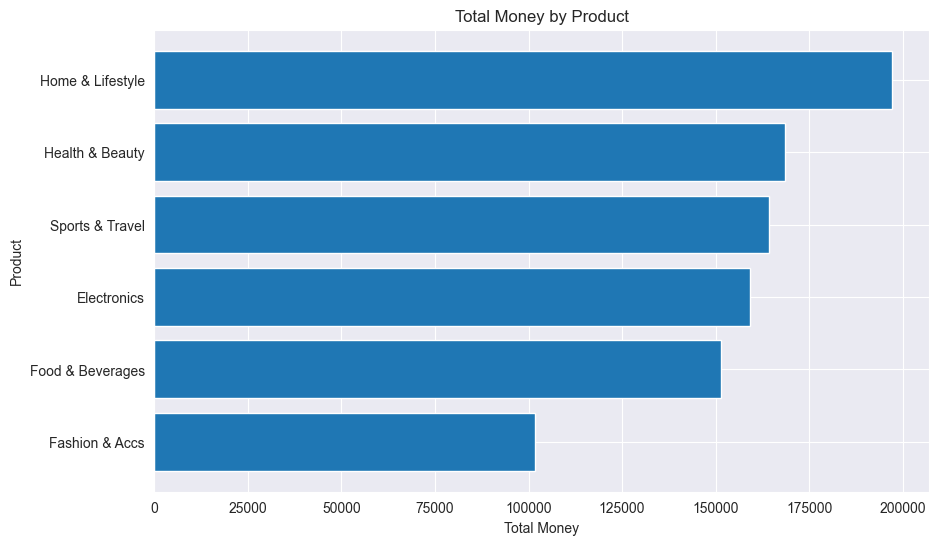

**10. Business Strategy Recommendations**

- Maximize sales of more expensive products in April and the beginning of the year (January–April).
- Ensuring optimal stock availability for the Food & Beverages and Health & Beauty categories.
- Improving customer retention programs in the Brooklyn area
- Conducting an aggressive marketing campaign in Queens during September to capitalize on its peak sales, as well as looking for ways to stabilize performance during the low period in May–July# stats-1

